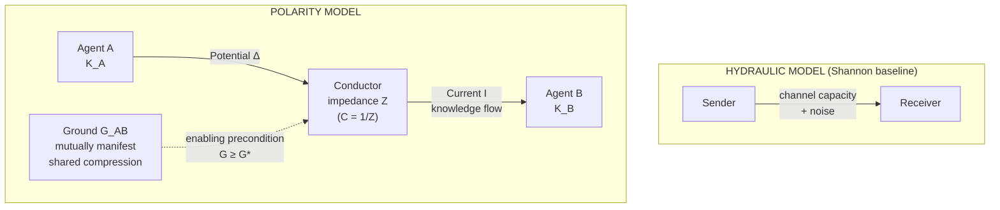

# The Polarity Hypothesis: Knowledge Flow Is an Electrical Phenomenon

**A Position Paper on the Foundational Model Underlying Information Systems in the Age of Semantic Compression**

*James Calhoun*
*Take Flight Advisors / The Grove Foundation*
*Draft v2 for Peer Review — April 2026*

---

## Abstract

This paper proposes that the dominant model underlying modern information systems — a hydraulic metaphor in which information *flows*, is *stored*, *leaks*, and *fills channels* — has mis-specified the phenomenon it most often serves. We argue that knowledge transfer between intelligent agents is not hydraulic but electrical, and that this distinction has material consequences for the architecture of systems mediating human-to-human, human-to-machine, and machine-to-machine exchange. We propose *knowledge polarity* as a foundational model: knowledge flow requires a mutual compression base (*ground*), an asymmetry between parties (*potential difference*), and a medium preserving dimensional structure in transit (*conductance*, the reciprocal of dimensional *impedance*). At insufficient ground, we argue the system exhibits phase-transition behavior analogous to percolation thresholds in statistical physics. Shannon's information theory measures the wire, Kolmogorov's algorithmic information theory measures the charge; neither describes the circuit, which is what large language models first make buildable. We reframe Polanyi's paradox as a property of ungrounded channels rather than human cognition, examine why hypertext, generative UI, retrieval-augmented generation, and current AI-native architectures remain hydraulic, and sketch what polarity-compliant systems — including a concrete grounding-handshake protocol — would require. Taken together, we propose the polarity hypothesis as the end-to-end argument restated for the Semantic Age.

**Keywords:** information theory, algorithmic information theory, tacit knowledge, large language models, knowledge representation, generative interfaces, retrieval-augmented generation, software architecture, hypertext, cognitive prosthesis, declarative systems, phase transitions

---

## 1. Introduction

The history of computer science is, in significant part, the history of a single metaphor. Information flows. It moves through channels. It fills buffers. It spills over. It leaks. It is stored in reservoirs, pumped through pipes, and delivered to consumers. The hydraulic metaphor is so deeply embedded in the discipline that it is rarely noticed as a metaphor at all. It shapes the vocabulary of networking, database design, operating system architecture, web infrastructure, and — more recently — the built systems we now call "AI-native."

The metaphor has served well. It gave Claude Shannon the framework for his foundational paper on the mathematical theory of communication (Shannon 1948), which quantified information as a measurable quantity moving through noisy channels. It gave us the OSI model, TCP/IP, and the architectural primitives underlying all contemporary networked systems. It is correct within its domain: for the transmission of signals between senders and receivers whose interpretive states we do not need to model, the hydraulic framing is not merely useful but formally adequate.

This paper argues that the hydraulic framing becomes inadequate at a specific and increasingly important boundary: the junction at which a signal received by an intelligent agent becomes knowledge incorporated into that agent's model of the world. At that boundary, hydraulic properties — volume, pressure, rate — cease to determine outcomes. What determines outcomes is the relationship between the compressed state of the sender and the compressed state of the receiver, and whether a medium exists to preserve the dimensional structure of the sender's intent while rendering it into a form the receiver can integrate.

We propose this relationship is better described as *electrical* than as fluidic. Specifically, we argue that knowledge flow between intelligent agents follows principles structurally analogous to electrical current: it requires a *ground* (shared compressed knowledge between the agents), a *potential difference* (asymmetry between their respective states), and a *conductor* (a medium whose properties preserve charge, i.e., dimensional structure, in transit). Remove any of the three, and what remains is not diminished knowledge flow but no knowledge flow at all. The signal may transmit; the knowledge does not.

We call this the *polarity hypothesis*, and its central implication is a reframing of what software itself is for. If the hydraulic model is correct, information systems are pipes, storage, and pumps, and their function is to move bytes with high fidelity and low latency. If the polarity model is correct, information systems are circuits, grounds, and conductors, and their function is to make knowledge flow possible between minds that were previously ungroundable.

The remainder of this paper is structured as follows. Section 2 reviews the hydraulic model's intellectual lineage and limitations. Section 3 summarizes the parallel history of algorithmic information theory and identifies the gap between it and Shannon's framework. Section 4 reframes Polanyi's paradox as a consequence of ungrounded channels rather than human cognition, and shows why large language models represent a novel category of conductor. Section 5 develops the polarity model formally, including its phase-transition behavior at the grounding threshold. Section 6 examines prior and current approximations — hypertext, generative interfaces, retrieval-augmented generation, and the Autonomaton Pattern. Section 7 discusses implications for software architecture and research. Section 8 concludes.

The scope of our claim is foundational: the model beneath contemporary information systems has been miscalibrated to the phenomenon it now most often serves, and an alternative — implicit in scattered recent research and practice — deserves explicit formalization.

## 2. The Hydraulic Model and Its Limits

Shannon's 1948 framework defined information with respect to a probability distribution over messages from a source. Entropy quantifies the average uncertainty resolved by receiving a message; channel capacity bounds the rate at which a noisy channel can transmit information without error. The theory is, by construction, about signals moving through a medium; it makes no claims about what the receiver does with received signals, nor about any relationship between sender and receiver beyond their shared access to the channel (Shannon 1948; Cover and Thomas 2006). This framework has underpinned the architecture of virtually every computing system developed in the seventy years since — networks designed as channels with capacity, storage as reservoirs with throughput, APIs as request-response flows, web protocols as delivery pipelines.

The hydraulic framing is so pervasive in the field that it structures our diagnostic vocabulary. Systems *leak* memory; buffers *overflow*; caches *fill*; data *flows through* pipelines. The metaphor is usually invisible to practitioners, but it governs the primitives we reach for when designing new systems.

Its limitations have been observed in adjacent literatures but rarely named as a unified problem. Weaver (1949) distinguished syntactic, semantic, and pragmatic information, noting that Shannon's framework addresses only the first. Barwise and Perry (1983) formalized the situation-dependence of meaning. Suchman (1987) and Hutchins (1995) showed that human understanding is irreducibly contextual in ways channel-based models cannot capture. Clark and Chalmers's (1998) "extended mind" thesis argued that cognition extends into environmental structures, implying a relationship between agent and environment richer than hydraulic transmission allows.

None of these literatures produced a formal alternative for information systems design. The dominant practice remains: move bytes with high fidelity and low latency, and leave the semantic and pragmatic layers to the application. This works when the receiver is another machine with an identical interpretive substrate — database to database, service to service over HTTP. It fails progressively as the interpretive gap between sender and receiver widens, and catastrophically at the point where the receiver is a human mind whose compressed model of the world may share very little with the sender's.

The failure has historically been papered over by practices outside software architecture proper: documentation, training, onboarding, user research, iterated design review, and the broader apparatus of technical communication. These practices are the compensation humans provide for infrastructure that does not natively support knowledge flow — expensive, lossy, and unevenly successful. They are also what gets eliminated first when organizations attempt to scale, removing exactly the practices that allow the hydraulic model to appear functional at the knowledge layer.

This is not accidental. It is the signature of a model mismatch. The hydraulic metaphor is correct for the channel layer and incorrect for the knowledge layer, and no amount of operational effort at the channel layer can substitute for a model addressing the knowledge layer directly.

We emphasize the scope of this claim. The polarity model does not replace transport-layer protocols. TCP/IP, the OSI reference model, storage primitives, and the broader suite of Shannon-derived engineering frameworks remain correct within their designed domains. They move bits with high fidelity, and should. The polarity model is a higher-dimensional overlay on these substrates, addressing the layer at which bits become knowledge in a receiving mind. The two frameworks compose: a polarity-compliant system runs over TCP/IP the way HTTP runs over TCP, relying on the lower layer for transport correctness while asserting its own semantics above it. The architectural mistake has not been in building hydraulic transport but in assuming the same primitives suffice for the knowledge layer above.

## 3. Algorithmic Information Theory and the Unbridged Gap

Parallel to Shannon's probabilistic framework, a second tradition developed in the 1960s that asked a different question: not how much information a message contains in expectation over a source distribution, but how much information a *specific* message contains, regardless of any distribution. Algorithmic information theory, developed independently by Solomonoff (1964), Kolmogorov (1965), and Chaitin (1966), formalized the *Kolmogorov complexity* of an object as the length of the shortest computer program that produces that object as output (Li and Vitányi 2019).

The two frameworks answer different questions. Shannon entropy characterizes sources; Kolmogorov complexity characterizes objects. The two can diverge arbitrarily: a message of low algorithmic complexity may have arbitrarily high Shannon entropy relative to an unstructured source, and vice versa (Grünwald and Vitányi 2008). Most existing engineering practice works within Shannon's framework and treats this divergence as a technicality. For the polarity model, it is the central fact.

Chaitin's compressed observation — that comprehension is compression — is foundational for the polarity model. If comprehension is compression, *shared* comprehension between two agents is *shared* compression: both have reduced the same regularities in a domain to a common short description. This is not shared data; it is shared *program*. Two agents who have independently arrived at the same compressed representation hold a structural isomorphism, not merely overlapping facts.

This is the theoretical primitive the polarity model requires. Algorithmic information theory makes it available but never connected it to the communication problem Shannon addressed — the two frameworks developed in domains with little direct exchange. Their connection is the question of how a sender's compressed state becomes a receiver's, which needs both frameworks simultaneously plus a third element neither supplied: a medium preserving compression structure across transmission.

Recent work in deep learning has inadvertently produced that third element. Large language models operate on high-dimensional vector representations — "latent spaces" — in which meaning is encoded geometrically rather than sequentially (Tibshirani et al. 2025). Their internal representations support latent reasoning: operations in representational space prior to serialization into discrete tokens. Hao et al.'s (2024) *Coconut* architecture demonstrated measurable performance gains when reasoning is conducted in continuous latent space rather than forced through token-level natural language — direct evidence that the native substrate of LLM cognition is higher-dimensional than the textual channel through which we typically interact with it.

Chohan (2025) argued that contemporary LLMs exhibit two of the three forms of tacit knowledge Polanyi (1966) identified: knowledge that could be codified but is too costly to translate, and knowledge of nuance and subtext encoded in natural language but not reducible to it. These are precisely the forms the hydraulic model cannot carry and the polarity model can. The gap that existed between Shannon and Kolmogorov for half a century is now bridgeable — not by a theorem but by an artifact. A sufficiently capable compression-preserving substrate exists, and the consequences for information systems architecture have not yet been integrated into foundational theory.

## 4. Polanyi's Paradox as a Circuit Problem

Michael Polanyi's *The Tacit Dimension* (1966) opened with the observation that we can know more than we can tell, and used it to ground a broader argument about the limits of propositional knowledge. Polanyi's examples — the face recognized but not describable, the skill of the driver that cannot be replaced by theoretical instruction — have been treated for sixty years as observations about the irreducibility of certain human knowledge to explicit form. Autor (2014) formalized the claim as "Polanyi's paradox" and used it to argue that automation would stall at precisely the boundary where tacit knowledge becomes operationally required.

We propose a reframing. Polanyi's paradox is not primarily a claim about the limits of human knowing; it is a claim about the limits of ungrounded transmission channels. Tacit knowledge cannot be put into propositional form *for an arbitrary receiver*. It can often be put into propositional form for a receiver with whom the sender shares sufficient compression — the apprentice who has watched the master long enough, the resident who has worked through hundreds of cases with a senior diagnostician, the graduate student who has come to understand an advisor's research program over years. The knowledge flows in these cases because ground has been slowly and expensively established. The apprenticeship tradition, viewed through the polarity lens, is a grounding protocol run over human-lifetime timescales.

This reframing is consistent with subsequent work in knowledge management (Nonaka and Takeuchi 1995), which identified the conversion of tacit to explicit knowledge as the fundamental challenge of organizational learning, and with work on expert intuition (Klein 1998; Kahneman 2011) showing that expert judgment is compressed pattern recognition that resists decomposition into rules. The common finding across both literatures is not that tacit knowledge cannot be shared, but that sharing it requires conditions — extended exposure, shared context, sustained mutual modeling — expensive to establish and fragile once established.

The polarity hypothesis makes this precise. Tacit knowledge is dimensional structure in the sender's compressed representation. Its transmission requires (a) a receiver whose compressed representation is sufficiently aligned to integrate the new dimensional structure, and (b) a conductor that does not flatten the structure in transit. Apprenticeship provides (a) through prolonged co-work and (b) through a combination of demonstration, observation, and interaction that preserves dimensionality better than serial prose. Writing a book, by contrast, usually satisfies neither: the arbitrary reader is ungrounded, and the textual channel is strongly lossy for the dimensional content that makes the knowledge tacit in the first place.

Rao (2023) described the return of tacit knowledge as a central concern in AI research after decades of exile under symbolic approaches — what he called "Polanyi's revenge." AlphaGo's ability to discover moves top human players could not articulate (Silver et al. 2016), and subsequent results from matrix multiplication (Novikov et al. 2025) to protein folding (Jumper et al. 2021), demonstrate that contemporary machine learning systems acquire and deploy knowledge exceeding what their designers can explicitly specify. The polarity model predicts this: what these systems acquire is compressed dimensional representation that resists linear articulation. They are, in effect, grounded with the training domain's structure in ways human apprentices rarely achieve. What they lack is a reliable mechanism for transferring that grounded structure to human minds — the problem the polarity model addresses.

## 5. The Polarity Model

We now develop the model with sufficient formality to be useful as a design reference and a basis for empirical test.

### 5.1 Primitives

Let $A$ and $B$ denote two intelligent agents, each of which maintains an internal compressed representation of some domain $D$. Denote these representations $K_A^D$ and $K_B^D$. These are not datasets; they are programs, in the Kolmogorov sense — the minimal generative structures from which the agents could reconstruct their experience of the domain. In human agents, these programs are inaccessible to introspection; in contemporary LLMs, they correspond (imperfectly) to learned distributions over latent representations.

We define four primitives:

**Ground** ($G_{AB}^D$): The portion of $K_A^D \cap K_B^D$ that is *mutually manifest* — known by each agent to be known by the other. Ground is not merely intersecting compression; it is intersection that both parties verify. Ground is established, not assumed, and its establishment is a distinct operation (see §5.4).

**Potential Difference** ($\Delta_{AB}^D$): The symmetric difference $K_A^D \triangle K_B^D$ of the agents' representations, *relative to* established ground. Only dimensions in the potential difference carry transmissible content; dimensions already in ground are redundant.

**Conductor** and **Impedance** ($C$, $Z$): A conductor is a medium whose properties preserve the dimensional structure of the source representation across transmission. We define *dimensional impedance* $Z$ as the degree to which a medium flattens, distorts, or substitutes its own interpretation for dimensional content in transit. Conductance $C = 1/Z$. Serial prose is a high-impedance medium for dimensional content. A dialogue mediated by an LLM with access to $K_A^D$ and the ability to query for relevant context from $K_B^D$ is a lower-impedance medium. A medium that injects its own interpretive substrate — flattening author intent into the medium's preferred form — raises impedance and reduces conductance proportionally.

**Current** ($I_{AB}^D$): The actual flow of knowledge from $A$ to $B$ — specifically, the rate at which dimensional structure from $K_A^D$ is incorporated into $K_B^D$ with its intent preserved. The polarity model asserts:

$$I_{AB}^D \propto \frac{\Delta_{AB}^D}{Z} \cdot \mathbb{1}\left[G_{AB}^D \geq G^*\right]$$

where $G^*$ is the minimum ground required for the circuit to close, and the indicator function captures the critical nonlinearity discussed in §5.2.

We offer two clarifications on the equation's status. First, we label the expression a *conceptual formalism*: its variables do not carry physical units, and the proportionality coefficient is not derived from first principles. The testable claim is not quantitative prediction but directional relationship — that current varies with potential and inversely with impedance, conditional on sufficient ground. Empirical instantiation of the variables will depend on the domain and the measurement apparatus, and we expect such instantiations to require domain-specific theory beyond the scope of this paper.

Second, the indicator function should be read as a *functional utility threshold*, not a literal claim that no bits move below threshold. Bits always move, in the Shannon sense, provided the channel is open. What the polarity model claims is that below $G^*$, those bits have zero expected utility for intent-aligned action on the receiver's part. The receiver may produce outputs that reference or recombine the transmitted material, but those outputs will not constitute knowledge integration in the sense the model requires: they will not participate coherently in the receiver's subsequent compressed reasoning about the domain. In this sense the model treats "hallucination" in contemporary LLM practice not as a defect of individual outputs but as the expected behavior of a system operating below its grounding threshold.

*Figure 1* presents the two models side by side:



**Figure 1.** The hydraulic model (top) treats communication as signal moving through a channel, parameterized by capacity and noise. The polarity model (bottom) treats knowledge flow as current through a circuit, requiring ground, potential difference, and a conductor with bounded impedance. The architectures are not subsets of each other; the polarity model describes a phenomenon — grounded knowledge integration between intelligent agents — that the hydraulic model does not attempt to address.

### 5.2 Consequences, Including Phase-Transition Behavior

The model yields several testable predictions that differ from what the hydraulic framework would suggest.

**Prediction 1: A phase transition at the grounding threshold.** The model's most provocative claim is the nonlinearity in the indicator function. Below a critical ground sufficiency $G^*$, intent-aligned knowledge integration does not occur at reduced rate; it does not occur at all. Bits continue to move and outputs continue to appear plausible, but their expected utility for coherent downstream reasoning by the receiver is zero. We emphasize this is a claim about *functional utility*, not about raw transmission. A reviewer may object that low-ground communication demonstrably conveys some bits — that a novice reading a technical paper absorbs something, even if not what the author intended. The polarity model's response is that what the novice absorbs is not knowledge integration in the sense the model requires: the absorbed bits lack the potential for intent-aligned action in the novice's subsequent reasoning about the domain. This is why the phenomenon is a phase transition rather than a smooth degradation. It is analogous to the percolation threshold in random graphs (Stauffer and Aharony 1994) or the critical point at which correlation lengths diverge in the Ising model: below threshold, the system exhibits one qualitative behavior (isolated signals, outputs that recombine source material without preserving intent); above threshold, another (connected comprehension, integrated reasoning, intent-preserving outputs). The model predicts empirical measurements of intent-aligned knowledge transfer as a function of ground sufficiency will show not a smooth curve but a sigmoid with an inflection point corresponding to $G^*$ (see Figure 2). This is experimentally tractable with contemporary LLM-mediated instruction studies and represents, we believe, the most direct empirical test of the polarity hypothesis available today.

```
Intent-Aligned
 Utility (I)
     │
 1.0 ┤                    ╭──────────────────
     │                   ╱
     │                  ╱
 0.5 ┤                 ╱    ← inflection
     │                ╱
     │               ╱
 0.0 ┤──────────────╯
     └─────────────↑──────────────────────────→
                   G*       Ground Sufficiency (G_AB)

       sub-threshold        supra-threshold
          region                region
   (outputs plausible,   (connected comprehension,
    no integration)       intent-preserving flow)
```

**Figure 2.** The predicted relationship between ground sufficiency and intent-aligned utility under the polarity model. Below the critical threshold $G^*$, transmitted signals produce no integrated knowledge regardless of bandwidth or message quality. Above $G^*$, utility rises sharply, approaching saturation as ground approaches full mutual manifestation. The inflection at $G^*$ is the empirical signature distinguishing the polarity model from a continuous-degradation hydraulic account.

**Prediction 2: Increasing bandwidth alone does not increase knowledge flow.** A channel of arbitrarily high Shannon capacity transmitting between an expert and a novice who share no ground produces, from the novice's perspective, noise or superficial pattern-matching rather than knowledge integration. This matches what educators have long observed regarding the limits of high-volume content delivery (Hattie 2009) and is consistent with the robust finding that educational interventions emphasizing more content without addressing prior knowledge fail more often than they succeed.

**Prediction 3: Grounding-establishment is the rate-limiting step in real-world knowledge transfer.** Expert-to-expert exchange within established shared ground proceeds orders of magnitude faster than expert-to-novice exchange, even when both transmit comparable absolute text volumes. The hydraulic model has no natural explanation; the polarity model predicts it directly. The disproportionate institutional investment in grounding protocols (apprenticeship, credentialing, contract negotiation, peer review) is consistent with the claim that these are the binding constraints on knowledge flow at scale.

**Prediction 4: Conductor quality matters more than message quality below a threshold of dimensional fidelity.** A well-written essay transmitted as flat text to an ungrounded reader transfers less knowledge than a poorly written but richly contextualized exchange in a medium supporting on-demand ground establishment. Early empirical work on LLM-mediated instruction (Mollick and Mollick 2023; Khan 2024) is consistent with this; studies of impedance-varying media would provide stronger tests.

**Prediction 5: Intent preservation is a conductance property, not a content property.** If the conductor substitutes its own interpretation of the source into the transmission, the receiver's resulting representation is shaped by the conductor rather than by the sender. This is an impedance effect: the medium has effectively subtracted dimensional structure from the source and substituted its own. This yields specific requirements for the architecture of LLM-mediated publishing (see §7) and suggests that "alignment" as currently discussed in AI research is a special case of the more general property of low interpretive impedance.

We note that these predictions are testable not only in principle but increasingly in practice. A reference implementation of a polarity-compliant architecture — discussed in §6.4 — is publicly available, exposes the grounding and approval stages as testable primitives, and asserts its structural claims against its own telemetry exhaust. This enables empirical evaluation of Predictions 1 and 5 against conformance-verified baselines, a mode of testing the hydraulic framework does not produce.

### 5.3 Why the Hydraulic Model Could Not See This

The polarity model was invisible under the hydraulic framework not because it was hidden but because its central phenomenon — the grounding requirement — was assumed away. Shannon's framework assumes that sender and receiver share a codebook. This assumption is reasonable for engineered systems in which the codebook is specified at design time. It is untenable for knowledge exchange between agents whose compressed representations are learned, partial, and mutually obscure.

Every information system we have built has inherited Shannon's codebook assumption, and every such system has pushed the grounding problem out of its own architecture and into the layer above it — typically the human user, who is expected to arrive at the system with whatever interpretive framework the system assumes. This externalization has been invisible as long as the users at the endpoints were a relatively homogeneous population with substantial shared ground from cultural and professional context. It becomes visible the moment the system must serve heterogeneous populations, or must serve one population while mediated by an intelligent intermediary that does not share their ground.

The present moment is the first in which both conditions obtain simultaneously and at scale. This is why the gap becomes visible now.

### 5.4 Grounding Protocols

A grounding protocol is a procedure by which two agents establish and verify mutual compression on a domain prior to substantive knowledge exchange. Human institutions have evolved several, including:

- Apprenticeship, which establishes ground through prolonged co-work;
- Examination and credentialing, which verify that a learner has reached a compression state assumed shared by a professional community;
- Contract negotiation, particularly the "stipulated facts" phase of legal proceedings, which explicitly surfaces mutual assumptions before adversarial exchange;
- Scientific peer review, which tests whether a submission's implicit grounds are shared by the reviewing community and negotiates them if not;
- The opening framing of expert meetings, which allocates substantial time to re-establishing shared ground.

These protocols are expensive. Much of what economists describe as the "cost of expertise" is not the cost of acquiring tacit knowledge but of establishing ground each time it must be deployed. The polarity model predicts — and we argue this is now observable in early deployments — that LLM-mediated grounding protocols can compress these costs by orders of magnitude. A professional preparing for a meeting by having both parties' AI systems exchange compressed positions in advance is running a grounding protocol at computational cost where previously it ran at professional time cost. The economic implications are beyond the scope of the present paper.

## 6. Prior and Current Approximations

Several existing technologies and research programs capture part of the polarity model while remaining overall hydraulic. We examine four.

### 6.1 Hypertext and the Memex

Bush's 1945 proposal for the memex and Nelson's 1965 coinage of hypertext (Bush 1945; Nelson 1987) are the deepest precursors to systems supporting knowledge work rather than mere data transmission. Both envisioned reader-controlled associative trails through author-fixed artifacts. The memex stored books, articles, and annotations and let users construct and preserve links capturing their own patterns of association.

The polarity model shows what hypertext achieved and what it did not. Hypertext allowed the *reader* to establish ground with the material by constructing trails reflecting the reader's own compression; it did not allow the *author* to specify dimensional structure that would be preserved across renderings to different readers. The trails are an artifact of reading, not of authoring. The web Berners-Lee built inherited this asymmetry: authors publish fixed artifacts, readers navigate them. The medium is magnificent at making bytes accessible and poor at making knowledge flow. It is a low-impedance medium for syntactic information and a high-impedance medium for dimensional content.

### 6.2 Generative Interfaces and Context Engineering

Recent work on generative UI (Leviathan and Valevski 2025; Vaithilingam et al. 2025) demonstrates that LLMs can generate not merely content but the interface through which content is rendered, producing query-specific adaptations that outperform static markdown in human preference evaluations. This is, in polarity terms, a partial recognition that rendering should be responsive to the receiver. It remains hydraulic in its underlying model: source is still treated as content to be delivered, and adaptation is purely presentational — the receiver's ground is addressed only implicitly through query phrasing.

In parallel, the emerging discipline of context engineering has developed a vocabulary and set of practices for assembling the information environment in which an LLM operates. The discipline traces to foundational industry commentary during 2024–2025, synthesized in Schmid (2024), and has since been formalized by industry analysts (Gartner 2026). Context engineering is the most direct engineering-community approach to grounding yet produced, though it has not been theorized as such. Its practitioners work empirically with the mechanisms determining whether an LLM's output is useful, and on inspection those mechanisms reduce to variations of ground establishment, potential-difference preservation, and conductance tuning. The polarity model provides a theoretical foundation these practices currently lack; with it, context engineering becomes specification of grounding protocols with testable properties.

### 6.3 Retrieval-Augmented Generation: Dimensional Fidelity versus Retrieval Accuracy

The architectural pattern that has most rapidly defined contemporary "AI-native" infrastructure — retrieval-augmented generation (RAG), typically paired with vector similarity search over enterprise content (Lewis et al. 2020; Gao et al. 2024) — deserves specific examination. Nearly every major cloud provider and enterprise AI platform in the current cycle has converged on roughly the same design: retrieve semantically relevant passages from a vector store, assemble them as context alongside the user query, generate a response. The pattern is effective for many applications and drives substantial measurable improvements over un-augmented models.

The polarity model nevertheless exposes a structural limitation its proponents have not named. RAG treats grounding as a *retrieval accuracy* problem: surface passages most closely matching the query; integration into output is handled by the generative model's generic capacities. This is refined hydraulics. The pipe has become intelligent about what to pump, but the model still assumes that pumping sufficient relevant content in front of the receiver establishes ground. It does not. Ground, as defined in §5.1, is mutually manifest shared compression, not a collection of retrieved facts. A passage retrieved and prepended to a prompt raises the probability the model's output references it; it does not establish that model and user hold a shared compression of the domain the passage represents.

The distinction is between *retrieval accuracy* and *dimensional fidelity*. Retrieval accuracy asks: did we pull the right bytes? Dimensional fidelity asks: did we preserve the structure of author intent, or did the medium substitute its own? The first is a hydraulic metric, the second an electrical one. A system optimized purely for retrieval accuracy can score well on its chosen benchmarks while producing outputs whose relationship to source intent is systematically distorted — not because retrieval failed, but because nothing in the architecture was charged with preserving dimensional structure across the retrieval-plus-generation pipeline.

A defender of the RAG pattern might reframe dimensional fidelity as a subset of semantic ranking: better retrieval of passages more aligned with author intent, more sophisticated reranking over those passages, more aggressive filtering of irrelevant context. This rebuttal collapses the distinction incorrectly. Ranking of any sophistication is still a hydraulic operation — choosing the best pipe. Dimensional fidelity is a structural property — ensuring that the conductor does not melt the source's intent into its own interpretive substrate. No amount of ranking improves the substrate's properties. The distinction is categorical: retrieval operates over content selection, polarity over signal integrity through transformation. A perfectly-ranked retrieval followed by a high-impedance generator produces low-fidelity output. A modestly-ranked retrieval followed by a low-impedance conductor can produce high-fidelity output. The architecture must be charged with the right problem.

This characterization applies broadly to the current generation of enterprise AI offerings and is not restricted to any single vendor. The family is large: mainstream RAG pipelines, vector-search-augmented agents, most commercially deployed "enterprise grounding" systems. As a direct corollary of Prediction 5 in §5.2, we predict this family will exhibit a characteristic failure mode: systems passing retrieval-accuracy benchmarks, appearing plausibly grounded at surface inspection, and nevertheless producing outputs that subtly misrepresent source intent in ways accumulating with scale. The diagnostic signature is that operators describe these failures as "hallucination" — a hydraulic metaphor implying leakage — when the underlying phenomenon is impedance: dimensional structure dissipating into the medium's interpretive substrate. Naming the phenomenon correctly is prerequisite to architecting around it.

### 6.4 The Autonomaton Pattern as Reference Implementation

Concurrent with the research above, recent work on governance architectures for AI systems has produced the *Autonomaton Pattern* (Calhoun 2025), an open specification for structuring AI-mediated action around an immutable five-stage pipeline: Telemetry, Recognition, Compilation, Approval, and Execution. The pattern was developed as a safety and governance specification and is not, in its original presentation, framed in polarity terms. We argue, however, that the pattern is an early architectural exemplar of a system built on polarity principles:

- Telemetry and Recognition together constitute a grounding stage: the system surfaces state and resolves intent before acting.
- Compilation produces a declarative specification of intent — a compressed representation of what the system will do — that is auditable prior to execution.
- Approval (implemented as an *Andon Gate* in direct reference to the Toyota Production System) is the explicit ground-verification moment between human intent and machine capability, at which polarity becomes defined.
- Execution is the flow of current, bounded by the integrity of the ground established in prior stages.

The pattern further enforces *cognitive agnosticism*: no model-specific identifiers appear in engine code, ensuring the circuit's ground is independent of any particular conducting medium. This corresponds precisely to the engineering principle that a well-designed circuit should function across generations of its conductive substrate. The pattern's published intellectual lineage synthesizes Saltzer, Reed, and Clark's (1984) end-to-end argument, Clark and Chalmers's (1998) extended mind thesis, and the MAPE-K self-management framework developed under IBM's autonomic computing program (Kephart and Chess 2003), among others. The connection to Saltzer-Reed-Clark merits particular emphasis. The end-to-end argument established that reliability properties belong at the endpoints of a communication system rather than in the network. The polarity model proposes the analogous claim for knowledge: grounding, intent integrity, and attestation belong at the cognitive endpoints (the agents) rather than in the intermediate inference layer. In this sense, the polarity hypothesis can be read as the end-to-end argument restated for the Semantic Age, and the Autonomaton Pattern as a reference implementation of that restatement.

A reference implementation of the pattern is publicly available as a Python codebase (Understory IP 2026). Its architecture is organized around three declarative artifacts — a routing configuration, a zone schema, and a pattern cache — plus a generic engine that is domain-agnostic by construction. A `blank_template` profile ships alongside the reference profile to demonstrate that the engine runs with zero domain configuration, direct evidence of the claim that domain logic must reside in configuration rather than code. The implementation is not the definitive instantiation of the pattern; it is proof that the pattern is buildable with contemporary tooling and that its claimed properties hold under adversarial testing.

The reference implementation's most important contribution for present purposes is methodological. It demonstrates that polarity-compliant architectures admit a distinct category of test: *conformance testing* rather than *accuracy testing*. Under the hydraulic model, software tests typically verify output correctness — did the system produce the right answer? Under the polarity model, tests verify *pathway integrity* — did the signal pass through each required stage of the circuit, with ground established and intent preserved? Every assertion in the reference suite is evaluated against the system's telemetry exhaust (a structured JSONL stream) rather than application state. Pipeline invariance is proved by asserting every run produces exactly five correlated stage traces sharing a common pipeline identifier (`test_pipeline_invariant.py`, `test_pipeline_compliance.py`). Zone-gating is proved by asserting Yellow and Red zone actions fire the Andon Gate and no handler reaches execution without passing through it (`test_andon_consent.py`). The cognitive-tier dynamics — confirmed LLM classifications migrating to local pattern cache — are proved by replaying identical inputs and asserting the second invocation resolves at the local tier without external call (`test_ratchet.py`). Full self-improvement loops are proved end-to-end in integration tests driving an observe-detect-propose-approve-execute sequence reconstructed entirely from the JSONL exhaust (`test_flywheel.py`).

The implications for formal methods research are direct. If the pattern's non-bypassability property — that no path from input to execution omits the grounding and approval stages — can be formally specified, it becomes mathematically provable that an agent running the pattern cannot act without a grounding signal. This converts a policy claim ("our system audits its actions") into a structural property ("the architecture precludes unaudited action"). Formal verification of such properties is within reach of existing model-checking tooling and represents an under-pursued research direction with substantial implications for AI governance.

We present the Autonomaton Pattern not as a candidate standard but as evidence that polarity-compliant architectures are buildable, conformance-testable, and formally verifiable. The pattern specification is published under an open license because the thesis requires it: the infrastructure layer that makes knowledge flow possible should not be owned by any single vendor, any more than the gauge of a rail track should. Architectures in this family may vary in implementation — the Compilation stage in particular admits considerable latitude in how intent representations are enriched before approval — but share the structural invariants that polarity is established before action, preserved through transformation, and recoverable from audit. The standards question is how to characterize the family, not which implementation wins.

## 7. Implications

If the polarity hypothesis is correct, the implications for information systems architecture are substantial. We enumerate the most consequential, beginning with the implication we believe carries the greatest near-term standards-body relevance.

### 7.1 Grounding as a First-Class Protocol

Current systems externalize grounding to the user or application layer; polarity-compliant systems surface grounding as an explicit step with its own data structures, APIs, and standards. This parallels how authentication, once an application concern, was promoted to an infrastructure concern with its own protocols and verifying parties. Grounding requires similar formalization.

A *Grounding Handshake* between two agents $A$ and $B$ over domain $D$ would proceed in six phases:

1. **Declaration.** Each agent declares a compressed representation of its position on $D$, at a mutually agreed level of abstraction, with confidence and scope claims.
2. **Reconciliation.** A neutral protocol or mutually trusted mediator — in practice, very possibly an LLM-mediated reconciliation service — identifies where $K_A^D$ and $K_B^D$ align and where they diverge.
3. **Ground Confirmation.** Both agents affirm the aligned portion is mutually manifest: known by each to be known by the other. This produces $G_{AB}^D$.
4. **Potential Surface.** The divergent portion is surfaced explicitly as $\Delta_{AB}^D$, visible to both as the territory where knowledge will be produced.
5. **Threshold Check.** If $G_{AB}^D \geq G^*$, the circuit is closed and current may flow. Otherwise agents iterate — either with additional grounding passes or by refusing the exchange as premature.
6. **Audit.** The grounding transcript is preserved and cryptographically attested, so subsequent exchanges across the established circuit are verifiable against the ground they were constructed on.

*Figure 3* diagrams the protocol as a sequence:

```mermaid
sequenceDiagram
    participant A as Agent A
    participant M as Mediator<br/>(reconciliation)
    participant B as Agent B

    Note over A,B: 1. Declaration
    A->>M: declare K_A^D (scope, confidence)
    B->>M: declare K_B^D (scope, confidence)

    Note over M: 2. Reconciliation<br/>compute K_A ∩ K_B and K_A △ K_B

    Note over A,B: 3. Ground Confirmation
    M->>A: propose aligned portion
    M->>B: propose aligned portion
    A-->>M: affirm mutually manifest
    B-->>M: affirm mutually manifest
    Note over A,M,B: G_AB^D established

    Note over A,B: 4. Potential Surface
    M->>A: surface Δ_AB^D
    M->>B: surface Δ_AB^D

    Note over M: 5. Threshold Check: G_AB ≥ G*?

    alt Threshold met
        Note over A,B: Circuit closed — current may flow
        A->>B: exchange across Δ_AB^D
    else Threshold not met
        Note over A,B: Iterate grounding, or refuse exchange
    end

    Note over M: 6. Audit (cryptographic attestation of transcript)
```

**Figure 3.** The six-phase Grounding Handshake as a sequence diagram. Phases 1–3 establish ground; phase 4 surfaces the actionable potential; phase 5 gates the circuit on the grounding threshold; phase 6 produces the audit trail. The mediator role may be filled by a protocol, a trusted third party, or an LLM reconciliation service; the protocol constraints are the same across implementations.

This is a sketch, not a specification. But it is the kind standards bodies (W3C, IEEE, IETF) could productively develop into interchange formats, verification properties, and reference implementations. The parallel to TLS handshakes, OAuth flows, and Diffie-Hellman key exchange is intentional: all establish preconditions for subsequent flow, and all were controversial categories before they were standardized.

A secondary consequence of formalizing grounding — flagged here for future work — is that systems implementing verified grounding protocols may establish a defensible accountability regime for AI-mediated action. Current regulatory frameworks struggle to attribute responsibility in systems whose behavior emerges opaquely from black-box inference over retrieved content. An architecture in which grounding is logged, compiled intent is inspectable, and approval is attested produces an audit trail whose structural properties are not present in current hydraulic systems. The adoption tailwind for polarity-compliant architectures is likely to come as much from this direction as from raw performance gains.

### 7.2 Further Implications

Beyond grounding protocols, the polarity model reshapes several adjacent architectural concerns.

**The authoring/rendering split becomes architectural, not stylistic.** Contemporary systems treat the authored artifact as the primary object and rendering as presentation. Under the polarity model, the authored artifact is a specification of intent; rendering is a per-receiver grounding-and-conduction operation. Authoring tools must capture dimensional structure rather than serial prose.

**Intent integrity replaces data integrity as the architectural problem.** Current systems emphasize data integrity: the bytes stored are the bytes retrieved. Polarity-compliant systems must emphasize intent integrity: the authored specification flows through rendering operations without being substantively altered by the conductor. This is a different problem class with different verification properties, and largely unsolved.

**Interoperability becomes a grid problem.** Networks of polarity-compliant systems require standards for exchanging grounded specifications across renderers the way the web requires standards for exchanging documents across browsers. Without such standards, the medium collapses into platform dependency — a failure mode the present technology cycle is already exhibiting.

**Legal and governance regimes require new categories.** The distinction between an authored specification and a per-receiver rendering has no clean analog in current copyright, authorship, or disclosure law. Attribution, liability, and disclosure obligations for this configuration are not settled.

**Research priorities realign.** Several active research areas — interpretability, alignment, retrieval-augmented generation, context engineering, constitutional AI — appear, from the polarity perspective, to be working on different aspects of the same underlying problem: how to build circuits whose grounds are auditable, whose conductances are characterized, and whose intent-integrity properties are verifiable. Framing them together may yield coordination gains their siloed progress does not.

## 8. Conclusion

We have argued that the dominant model underlying information systems has miscalibrated to the phenomenon it most often serves, and that an alternative — knowledge polarity, modeled on electrical rather than hydraulic principles — better describes how knowledge flows between intelligent agents. The model's components (ground, potential difference, conductance, current, impedance) map cleanly onto concepts already implicit in Polanyi's work, Kolmogorov's complexity theory, and contemporary LLM practice. What is new is the proposal to treat them as a unified architectural framework and to take seriously the phase-transition behavior the model predicts at the grounding threshold.

The stakes are substantial. The current technology cycle will produce either open knowledge-grid infrastructure — circuits whose grounds are interoperable and whose intent-integrity properties are verifiable — or a new generation of walled gardens in which grounding is proprietary and knowledge flow is captured. The choice is not being made explicitly; it is being made by the cumulative effect of design decisions at thousands of organizations still operating under the hydraulic model and, increasingly, under the refined-hydraulics model that retrieval-augmented architectures represent.

We offer this paper as an invitation to make the choice explicitly. The theoretical work required is tractable with existing research community resources. The empirical work — in particular the phase-transition prediction of §5.2 — is accessible with contemporary experimental instruments. The standards work is substantial but not unprecedented; comparable efforts produced the web, the internet, and the core cryptographic standards on which both depend.

Knowledge has always had polarity. We simply did not have a medium through which it could be observed directly. We do now, and what we choose to build on top of that observation will determine whether the next generation of information systems extends human intellectual capacity or constrains it to the shape of the tools we inherited from a hydraulic century. The end-to-end argument established, forty years ago, that the critical properties of a communication system belong at its endpoints. The polarity hypothesis is the restatement of that principle for the Semantic Age. Where Saltzer, Reed, and Clark proposed reliability lives at the endpoints of networks, we propose ground, intent, and integrity live at the endpoints of cognition. The intermediate inference layer, however capable, cannot substitute for either.

---

## References

Autor, D. 2014. "Polanyi's Paradox and the Shape of Employment Growth." NBER Working Paper 20485. National Bureau of Economic Research.

Barwise, J., and Perry, J. 1983. *Situations and Attitudes*. MIT Press.

Bush, V. 1945. "As We May Think." *The Atlantic Monthly*, July 1945: 101–108.

Calhoun, J. 2025. "The Autonomaton Pattern: An Architectural Standard for Auditable AI Governance." The Grove Foundation, open specification GRV-001, published CC BY 4.0.

Chaitin, G. J. 2004. *Algorithmic Information Theory*. Cambridge University Press.

Chohan, U. W. 2025. "Tacit Knowledge in Large Language Models." *The Review of Austrian Economics*. Advance online publication, https://doi.org/10.1007/s11138-025-00710-5.

Clark, A., and Chalmers, D. 1998. "The Extended Mind." *Analysis* 58(1): 7–19.

Cover, T. M., and Thomas, J. A. 2006. *Elements of Information Theory*, 2nd ed. Wiley-Interscience.

Gao, Y., Xiong, Y., Gao, X., et al. 2024. "Retrieval-Augmented Generation for Large Language Models: A Survey." arXiv:2312.10997v5.

Gartner, Inc. 2026. "Definition of Context Engineering." In *Gartner Glossary: Artificial Intelligence*.

Grünwald, P., and Vitányi, P. 2008. "Shannon Information and Kolmogorov Complexity." CWI Technical Report.

Hao, S., Sukhbaatar, S., Su, D., Li, X., Hu, Z., Weston, J., and Tian, Y. 2024. "Training Large Language Models to Reason in a Continuous Latent Space." arXiv:2412.06769.

Hattie, J. 2009. *Visible Learning: A Synthesis of Over 800 Meta-Analyses Relating to Achievement*. Routledge.

Hutchins, E. 1995. *Cognition in the Wild*. MIT Press.

Jumper, J., Evans, R., Pritzel, A., et al. 2021. "Highly Accurate Protein Structure Prediction with AlphaFold." *Nature* 596: 583–589.

Kahneman, D. 2011. *Thinking, Fast and Slow*. Farrar, Straus and Giroux.

Kephart, J. O., and Chess, D. M. 2003. "The Vision of Autonomic Computing." *IEEE Computer* 36(1): 41–50.

Khan, S. 2024. *Brave New Words: How AI Will Revolutionize Education (And Why That's a Good Thing)*. Viking.

Klein, G. 1998. *Sources of Power: How People Make Decisions*. MIT Press.

Kolmogorov, A. N. 1965. "Three Approaches to the Quantitative Definition of Information." *Problems of Information Transmission* 1(1): 1–7.

Leviathan, Y., and Valevski, D. 2025. "Generative UI: LLMs are Effective UI Generators." Google Research, preprint.

Lewis, P., Perez, E., Piktus, A., et al. 2020. "Retrieval-Augmented Generation for Knowledge-Intensive NLP Tasks." *Advances in Neural Information Processing Systems* 33: 9459–9474.

Li, M., and Vitányi, P. 2019. *An Introduction to Kolmogorov Complexity and Its Applications*, 4th ed. Springer.

Mollick, E., and Mollick, L. 2023. "Assigning AI: Seven Approaches for Students, with Prompts." arXiv:2306.10052.

Nelson, T. H. 1987. *Literary Machines*. Mindful Press.

Nonaka, I., and Takeuchi, H. 1995. *The Knowledge-Creating Company*. Oxford University Press.

Novikov, A., et al. 2025. "AlphaEvolve: Discovering Heuristics via Evolutionary Search with Large Language Models." DeepMind technical report.

Polanyi, M. 1966. *The Tacit Dimension*. University of Chicago Press.

Rao, S. 2023. "Polanyi's Revenge and AI's New Romance with Tacit Knowledge." *Communications of the ACM* 66(2): 36–38.

Saltzer, J. H., Reed, D. P., and Clark, D. D. 1984. "End-to-End Arguments in System Design." *ACM Transactions on Computer Systems* 2(4): 277–288.

Schmid, P. 2024. "The New Skill in AI Is Not Prompting, It's Context Engineering." Technical essay synthesizing public commentary from Karpathy, Lutke, and others on the emergence of context engineering as a distinct discipline.

Shannon, C. E. 1948. "A Mathematical Theory of Communication." *Bell System Technical Journal* 27(3): 379–423.

Silver, D., Huang, A., Maddison, C. J., et al. 2016. "Mastering the Game of Go with Deep Neural Networks and Tree Search." *Nature* 529: 484–489.

Solomonoff, R. J. 1964. "A Formal Theory of Inductive Inference, Part I." *Information and Control* 7(1): 1–22.

Stauffer, D., and Aharony, A. 1994. *Introduction to Percolation Theory*, 2nd ed. Taylor and Francis.

Suchman, L. A. 1987. *Plans and Situated Actions: The Problem of Human-Machine Communication*. Cambridge University Press.

Tibshirani, M., et al. 2025. "Shape Happens: Automatic Feature Manifold Discovery in LLMs via Supervised Multi-Dimensional Scaling." arXiv preprint.

Understory IP. 2026. "The Grove Autonomaton — Reference Implementation." Open-source Python codebase, https://github.com/understory-ip/autonomaton-primitive.

Vaithilingam, P., et al. 2025. "Generative Interfaces for Language Models." arXiv:2508.19227.

Weaver, W. 1949. "Recent Contributions to the Mathematical Theory of Communication." In Shannon and Weaver, *The Mathematical Theory of Communication*. University of Illinois Press.
